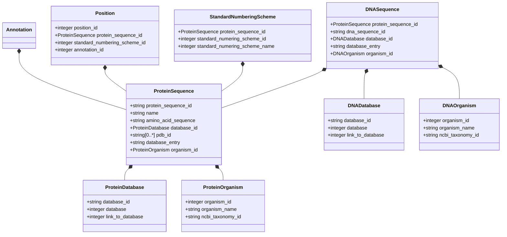

```mermaid
classDiagram
    ProteinSequence *-- ProteinDatabase
    ProteinSequence *-- ProteinOrganism
    DNASequence *-- ProteinSequence
    DNASequence *-- DNADatabase
    DNASequence *-- DNAOrganism
    StandardNumberingScheme *-- ProteinSequence
    Position *-- ProteinSequence
    Annotation *-- ProteinSequence
    
    class ProteinSequence {
        +string protein_sequence_id
        +string name
        +string amino_acid_sequence
        +ProteinDatabase database_id
        +string[0..*] pdb_id
        +string database_entry
        +ProteinOrganism organism_id
    }
    
    class DNASequence {
        +ProteinSequence protein_sequence_id
        +string dna_sequence_id
        +DNADatabase database_id
        +string database_entry
        +DNAOrganism organism_id
    }
    
    class ProteinOrganism {
        +integer organism_id
        +string organism_name
        +string ncbi_taxonomy_id
    }
    
    class DNAOrganism {
        +integer organism_id
        +string organism_name
        +string ncbi_taxonomy_id
    }
    
    class ProteinDatabase {
        +string database_id
        +integer database
        +integer link_to_database
    }
    
    class DNADatabase {
        +string database_id
        +integer database
        +integer link_to_database
    }
    
    class StandardNumberingScheme {
        +ProteinSequence protein_sequence_id
        +integer standard_numering_scheme_id
        +integer standard_numering_scheme_name
    }
    
    class Position {
        +integer position_id
        +ProteinSequence protein_sequence_id
        +integer standard_numbering_scheme_id
        +integer annotation_id
    }
    
```