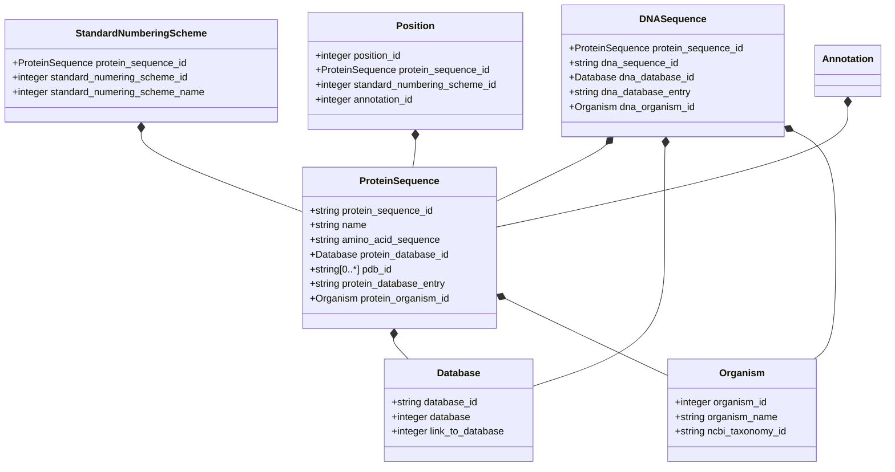

```mermaid
classDiagram
    ProteinSequence *-- Database
    ProteinSequence *-- Organism
    DNASequence *-- ProteinSequence
    DNASequence *-- Database
    DNASequence *-- Organism
    StandardNumberingScheme *-- ProteinSequence
    Position *-- ProteinSequence
    Annotation *-- ProteinSequence
    
    class ProteinSequence {
        +string protein_sequence_id
        +string name
        +string amino_acid_sequence
        +Database protein_database_id
        +string[0..*] pdb_id
        +string protein_database_entry
        +Organism protein_organism_id
    }
    
    class DNASequence {
        +ProteinSequence protein_sequence_id
        +string dna_sequence_id
        +Database dna_database_id
        +string dna_database_entry
        +Organism dna_organism_id
    }
    
    class Organism {
        +integer organism_id
        +string organism_name
        +string ncbi_taxonomy_id
    }
    
    class Database {
        +string database_id
        +integer database
        +integer link_to_database
    }
    
    class StandardNumberingScheme {
        +ProteinSequence protein_sequence_id
        +integer standard_numering_scheme_id
        +integer standard_numering_scheme_name
    }
    
    class Position {
        +integer position_id
        +ProteinSequence protein_sequence_id
        +integer standard_numbering_scheme_id
        +integer annotation_id
    }
    
```