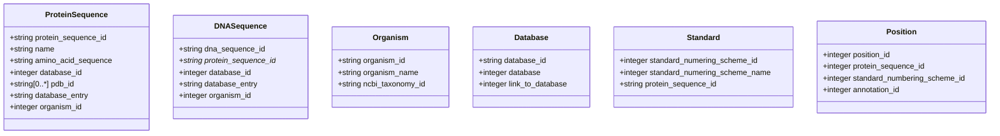

```mermaid
classDiagram
    
    class ProteinSequence {
        +string protein_sequence_id
        +string name
        +string amino_acid_sequence
        +integer database_id
        +string[0..*] pdb_id
        +string database_entry
        +integer organism_id
    }
    
    class DNASequence {
        +string dna_sequence_id
        +string protein_sequence_id*
        +integer database_id
        +string database_entry
        +integer organism_id
    }
    
    class Organism {
        +string organism_id
        +string organism_name
        +string ncbi_taxonomy_id
    }
    
    class Database {
        +string database_id
        +integer database
        +integer link_to_database
    }
    
    class Standard {
        +integer standard_numering_scheme_id
        +integer standard_numering_scheme_name
        +string protein_sequence_id
    }
    
    class Position {
        +integer position_id
        +integer protein_sequence_id
        +integer standard_numbering_scheme_id
        +integer annotation_id
    }
    
```